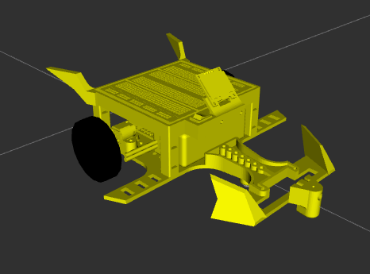
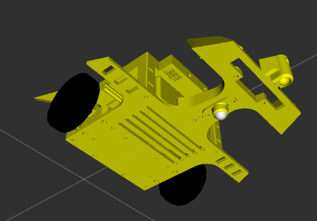
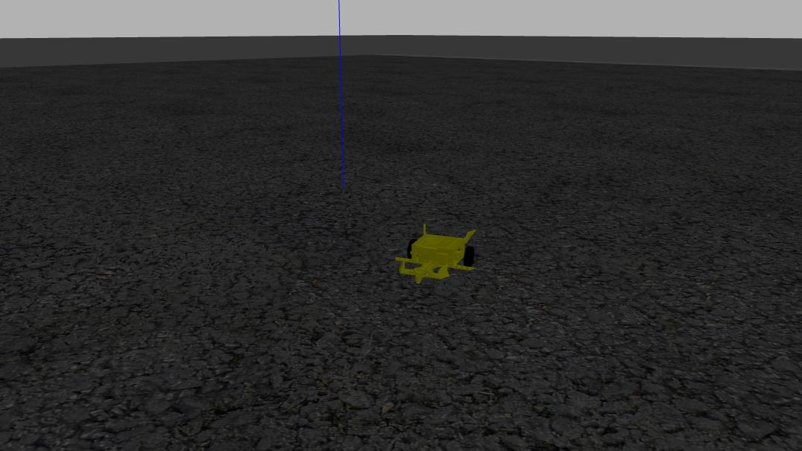

Here we are going to describe the Simulation build and configuration.

## Creating LIA Robot URDF file

In order to create the robot on the simulation we're going to create a URDF file, that describes our robot on the simulation world. The urdf file is xml based and we can use to representate our robot. For this step I followed this tutorial to create the URDF 

[# Creating a rough 3D model of our robot with URDF](https://www.youtube.com/watch?v=BcjHyhV0kIs)

A package template can be found in this link
[Robot Package Template](https://github.com/joshnewans/articubot_one/tree/d5aa5e9bc9039073c0d8fd7fe426e170be79c087)


After a few hours, I managed to create the urdf and I also imported the STL meshes that I built on Fusion360, here's the Lia URDF representation on rviz2:




]

## Starting with gazebo


In order to get gazebo up and running we have this command:

**gazebo_launch:**
```
ros2 launch gazebo_ros gazebo.launch.py
```

To add our robot on simulation:

**spawn_entity:**
```
ros2 run gazebo_ros spawn_entity.py -topic robot_description -entity lia_robot
```


After a few moments, I managed to get a launch file that wraps up everything for the simulation

```
ros2 launch lia_robot launch_sim.launch.py
```

We can now, teleoperate our robot with
```
ros2 run teleop_twist_keyboard teleop_twist_keyboard
``` 

As we can see in this image:




And in gazebo we can see her in motion on this little video:

