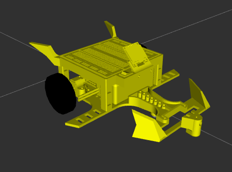
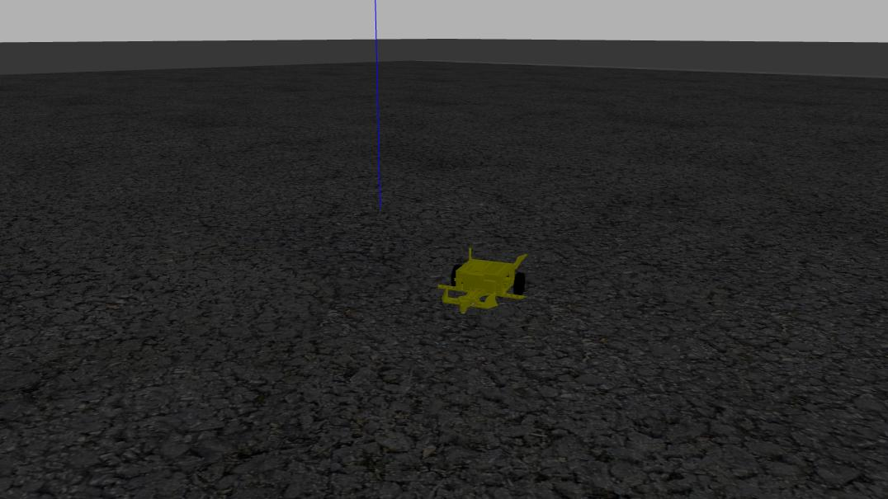

Here we are going to describe the Simulation build and configuration.

## Creating LIA Robot URDF file

In order to create the robot on the simulation we're going to create a URDF file, that describes our robot on the simulation world. The urdf file is xml based and we can use to representate our robot. For this step I followed this tutorial to create the URDF 

[# Creating a rough 3D model of our robot with URDF](https://www.youtube.com/watch?v=BcjHyhV0kIs)

A package template can be found in this link
[Robot Package Template](https://github.com/joshnewans/articubot_one/tree/d5aa5e9bc9039073c0d8fd7fe426e170be79c087)


After a few hours, I managed to create the urdf and I also imported the STL meshes that I built on Fusion360, here's the Lia URDF representation on rviz2:

This is the first version of LIA:



]

In order to run just the URDF + Rviz2 visualization run the robot state publisher with this command
```
ros2 launch lia_robot rsp.launch.py

# on another terminal launch rviz
rviz2

```

If you can't see your wheels:
```
ros2 run joint_state_publisher_gui joint_state_publisher_gui
```

After a few weeks I managed a little update on the design:


## Starting with gazebo


In order to get gazebo up and running we have this command:

**gazebo_launch:**
```
ros2 launch gazebo_ros gazebo.launch.py
```

To add our robot on simulation:

**spawn_entity:**
```
ros2 run gazebo_ros spawn_entity.py -topic robot_description -entity lia_robot
```


After a few moments, I managed to get a launch file that wraps up everything for the simulation

```
ros2 launch lia_robot launch_sim.launch.py
```

We can now, teleoperate our robot with
```
ros2 run teleop_twist_keyboard teleop_twist_keyboard
``` 

As we can see in this image:




And in gazebo we can see her in motion on this little video:

![[Lia_teleop_circle.mp4]]
https://github.com/ooiuri/lia-mpc/assets/40905287/e65f3a5c-4b19-4e91-9cd5-1993c69d9903

### Adding a Camera 

Now we are going to add a camera to our robot, a really great tutorial can be found in this video

[How to use Cameras in ROS](https://www.youtube.com/watch?v=A3nw2M47K50)

Install the image compression plugins:
```
sudo apt install ros-humble-image-transport-plugins
```

```
sudo apt install ros-humble-rqt-image-view
```

Running image view:
```
ros2 run rqt_image_view rqt_image_view
```

Had to install some deps:
```
pip install pyqt5 catkin_pkg
``` 

	If compressed or uncompressed topics is not showing, watch the video